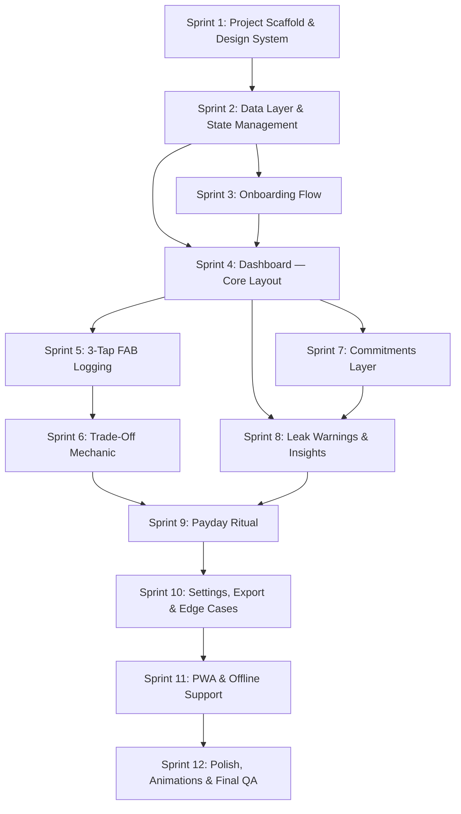

# Fiscal Fold — MVP Build Task Breakdown

> **Status:** ✅ Completed — Sprints 1–12 shipped (May 2026). Kept here as a historical reference for the original build plan. See [`../CHANGELOG.md`](../CHANGELOG.md) for what was actually built and any post-MVP work.

A sprint-by-sprint breakdown of the Smart Envelope PRD into **independently buildable tasks**. Each task is scoped to be completed in a single focused session, with clear inputs, outputs, and acceptance criteria.

---

## Dependency Map

---

## Sprint 1 — Project Scaffold & Design System

**Goal:** Set up the Vite PWA project with the full design system so every subsequent sprint has a polished visual foundation to build on.

### Task 1.1 — Initialize Vite Project
- Scaffold a Vite + vanilla JS/TS project in `fiscal-fold/`
- Configure PWA manifest (`manifest.json`) with app name, icons, theme color
- Set up folder structure: `/src`, `/src/styles`, `/src/components`, `/src/pages`, `/src/utils`, `/src/data`
- Add `index.html` with meta tags, viewport, PWA manifest link

### Task 1.2 — Design System & Global Styles
- Create `index.css` with the full design token system:
  - **Color palette:** Greens (safety), warm ambers (warnings), deep slate/charcoal (backgrounds) — never red for failure states
  - **Typography:** Import Google Font (e.g., Inter or Outfit), define type scale
  - **Spacing & radius scale**
  - **Geometric origami aesthetic:** clean card styles, subtle borders, math-driven proportions
  - **Dark mode as default** (finance apps feel premium in dark)
- Define reusable CSS classes: `.card`, `.health-bar`, `.btn-primary`, `.btn-ghost`, `.fab`, `.drawer`, `.badge`
- Responsive breakpoints (mobile-first: 375px → 768px → 1024px)

### Task 1.3 — App Shell & Navigation Skeleton
- Create the persistent app shell: top bar (greeting + settings icon), main content area, bottom FAB
- Implement a simple client-side router (hash-based) for page switching: `/onboarding`, `/dashboard`, `/settings`
- Empty page placeholders for each route

> **Acceptance:** App runs locally via `npm run dev`, shows the shell with correct fonts/colors/dark-mode on both mobile and desktop viewports.

---

## Sprint 2 — Data Layer & State Management

**Goal:** Build the entire data model and state management so all UI sprints can read/write data without worrying about persistence.

### Task 2.1 — Data Models
Define TypeScript interfaces / JS object shapes for:
- `User` — name, salaryDate, createdAt
- `BudgetCycle` — startDate, endDate, salary, macroAllocations, isActive
- `MacroCategory` — type (needs/wants/future), ratio, allocatedAmount
- `MicroBucket` — name, emoji, macroType, allocatedAmount, spentAmount, isPinned
- `Transaction` — amount, bucketId, note, timestamp, borrowedFrom?
- `Commitment` — name, amount, dueDate, macroType, isActive
- `Sweep` — amount, sweptTo, timestamp

### Task 2.2 — State Manager (Local-First)
- Create a lightweight reactive store (pub/sub pattern or a simple proxy-based store)
- All reads/writes go through the store
- Store persists to `localStorage` on every mutation (sync) and IndexedDB for large data (transactions)
- Expose methods: `getUser()`, `getCurrentCycle()`, `getBuckets()`, `addTransaction()`, `borrowFromBucket()`, `runSweep()`, etc.

### Task 2.3 — Seed Data & Dev Helpers
- Create a `seedData()` function that populates a realistic demo state (salary ₹1,68,000, 50/30/20 split, 6–8 micro-buckets, 15+ transactions over 10 days)
- Add a dev toolbar toggle (only in dev mode) to: reset data, seed demo data, jump to payday

> **Acceptance:** Console-driven tests — can create a cycle, add transactions, borrow between buckets, run a sweep, and verify all balances are correct.

---

## Sprint 3 — Onboarding Flow

**Goal:** Build the 4-step onboarding wizard that takes a new user from zero to a fully configured first budget cycle.

### Task 3.1 — Step 1: Identity
- Skip-and-name flow: simple name input with a warm greeting preview
- "Continue with Google" button (visually present, wired to store — actual OAuth deferred to BaaS sprint)
- Store user name in state

### Task 3.2 — Step 2: The Anchor (Fixed Income)
- Large, formatted currency input (₹ prefix, comma formatting as user types)
- Salary date picker (1st, 7th, 15th, 25th, Last Working Day, Custom)
- Visual salary card that updates live

### Task 3.3 — Step 3: The Golden Rule
- Interactive slider or preset selector for Needs/Wants/Future ratio
- Presets: Balanced (50/30/20), Aggressive Growth (40/20/40), Conservative (60/25/15)
- Live-updating donut/bar chart showing the split in ₹ amounts
- Custom slider mode with constraints (must sum to 100%)

### Task 3.4 — Step 4: Emotional Anchors (Micro-Buckets)
- Suggested starter templates per macro category (user can rename/remove)
- "Add custom bucket" with name + emoji picker
- Allocation slider per bucket within each macro category
- Micro-bucket cap enforced (8–10 per macro)

### Task 3.5 — Onboarding Completion
- Pro-rate logic: calculate remaining days in current cycle based on salary date
- Create the first `BudgetCycle` in state with all allocations
- Transition animation to dashboard

> **Acceptance:** New user completes onboarding in <2 minutes, lands on dashboard with fully configured cycle. Refresh preserves state.

---

## Sprint 4 — Dashboard Core Layout

**Goal:** Build the main dashboard that makes the user "feel good in 5 seconds."

### Task 4.1 — Safe to Spend Hero
- Massive, prominent number showing total available across Wants buckets
- Subtle animation on load (count-up)
- Secondary line: "X days left in cycle"
- Color shifts: green (healthy) → amber (watch it) → muted (getting tight)

### Task 4.2 — Macro Health Bars
- Three geometric progress bars for Needs, Wants, Future
- Show: allocated | spent | remaining for each
- Origami-inspired card design — clean lines, subtle gradients
- Tap to expand → shows child micro-buckets within each macro

### Task 4.3 — Micro-Bucket Grid (Expanded View)
- When a macro bar is expanded, show its micro-buckets as a compact grid/list
- Each bucket card: emoji + name + mini progress bar + ₹ remaining
- Visual state: healthy / watch / depleted (green → amber → muted, never red)

### Task 4.4 — Recent Transactions Feed
- Scrollable list of last 5–10 transactions
- Each row: amount, bucket emoji + name, time ago, optional note
- Trade-off transactions show a subtle "borrowed from X" badge
- "See all" link to full transaction history page

> **Acceptance:** Dashboard renders correctly on mobile (375px) and desktop (1024px+). Safe to Spend number is the dominant visual element. Seeded demo data displays correctly.

---

## Sprint 5 — 3-Tap FAB Logging

**Goal:** Build the core transaction logging flow — the most-used interaction in the app.

### Task 5.1 — Floating Action Button
- Persistent FAB at bottom-center of dashboard
- Prominent but not obstructing — "+" icon with subtle pulse on first visit
- Opens the logging modal/drawer on tap

### Task 5.2 — Tap 1: Amount Entry
- Full-screen (or large drawer) numeric keypad
- Oversized touch targets for mobile
- Live-formatted display (₹1,250 as user types)
- Backspace + Clear buttons
- "Next" button becomes active when amount > 0

### Task 5.3 — Tap 2: Bucket Selection
- Transitions from keypad to bucket grid
- **Quick Buckets row** at top (3–4 most used, pinned)
- All buckets below, grouped by macro category
- Each bucket shows remaining balance
- Visual feedback on selection

### Task 5.4 — Tap 3: Confirmation
- If funds sufficient: show confirmation card (amount + bucket + remaining after)
- Confirm button with satisfying animation (checkmark, subtle haptic if supported)
- Optional note field (collapsed by default, tap to expand)
- Transaction saved to state, dashboard updates instantly

> **Acceptance:** User can log a transaction in 3 taps (<5 seconds for a returning user). Dashboard Safe to Spend and bucket balances update immediately.

---

## Sprint 6 — Trade-Off Mechanic

**Goal:** Build the "borrowing" flow — the app's signature feature that replaces guilt with agency.

### Task 6.1 — Insufficient Funds Detection
- When Tap 3 detects the selected bucket has insufficient funds:
  - Show shortfall amount clearly
  - "Which bucket should cover the difference?" prompt

### Task 6.2 — Trade-Off Drawer
- Slides up showing all other buckets with available funds
- Each bucket: emoji + name + available balance
- User selects one (or splits across multiple? — Phase 1: single source only)
- Clear display: "₹X from [selected bucket] → [target bucket]"

### Task 6.3 — Trade-Off Confirmation
- Dual-update confirmation: deducts from source bucket, funds the target transaction
- Transaction saved with `borrowedFrom` reference
- Dashboard reflects both bucket changes
- Subtle visual treatment (not a warning — a conscious choice)

> **Acceptance:** Attempting to log ₹500 to a bucket with ₹200 remaining triggers the trade-off drawer. Borrowing from another bucket completes the transaction. Both buckets reflect accurate balances.

---

## Sprint 7 — Commitments Layer

**Goal:** Let users define recurring expenses so the dashboard shows honest "Safe to Spend" numbers.

### Task 7.1 — Commitments Management UI
- Accessible from Settings or during onboarding
- Add commitment: name, amount, due date (day of month), macro category
- List of active commitments with edit/delete
- Toggle active/inactive for seasonal commitments

### Task 7.2 — Auto-Deduction Logic
- On budget cycle start, auto-deduct all active commitments from their respective macro buckets
- Commitments show as "reserved" in bucket balances (distinct from spent)
- Dashboard Safe to Spend reflects post-commitment balance

### Task 7.3 — Commitment Due Date Tracking
- Visual indicator on dashboard when a commitment due date is approaching
- Mark as "paid" when the user logs the actual transaction (or auto-mark on due date)

> **Acceptance:** User adds Rent (₹25,000) and Netflix (₹649) as commitments. New cycle auto-deducts these. Safe to Spend reflects the true available balance.

---

## Sprint 8 — Leak Warnings & Insights

**Goal:** Add the predictive, friendly nudges that help users course-correct mid-cycle.

### Task 8.1 — Leak Detection Algorithm
- Calculate: (% of bucket spent) vs. (% of cycle elapsed)
- Trigger warning when bucket is >80% spent but cycle is <50% through
- Trigger "on track" affirmation when spending pace matches or trails time pace

### Task 8.2 — Warning Cards on Dashboard
- Non-intrusive card below the hero section
- Warm amber accent (not red)
- Friendly copy: *"Dining is running hot — want to re-balance?"*
- Tap to open re-balance flow (shortcut to trade-off mechanic)

### Task 8.3 — "On Track" Affirmations
- When all buckets are healthy, show positive reinforcement
- *"All clear — you're on pace this cycle."*
- Subtle green glow or check animation

> **Acceptance:** With seeded data where Dining is 80% spent on day 10 of 30, a leak warning card appears. When all buckets are healthy, an affirmation shows instead.

---

## Sprint 9 — Payday Ritual

**Goal:** Build the guided monthly flow that creates the habit loop and dopamine hit.

### Task 9.1 — Payday Trigger
- Detect when salary date arrives (or user manually triggers "I got paid")
- Show a prominent in-app prompt: *"Payday! Ready for your 3-minute ritual?"*
- Entry point also available from settings

### Task 9.2 — Step 1: Confirm Income
- Pre-filled with expected salary
- Option to adjust (for variable months) or add bonus
- "Confirm" creates the new budget cycle

### Task 9.3 — Step 2: Last Month's Scorecard
- Summary card: total spent, total saved, sweep amount
- Motivational stat: *"You saved ₹12,400 more than last month!"*
- Mini breakdown by macro category
- Sweep animation showing leftover flowing into Future bucket

### Task 9.4 — Step 3: Adjust Allocations
- Show current ratios with option to tweak
- Add/remove/rename micro-buckets
- Quick adjustments for the month ahead

### Task 9.5 — Step 4: Clean Slate
- Full health bars animation — everything resets to full
- Celebratory micro-animation
- *"You're in control. Let's go."*
- Transition to fresh dashboard

> **Acceptance:** End-to-end payday ritual flow works. Sweep calculates correctly. New cycle inherits user's bucket structure with fresh allocations.

---

## Sprint 10 — Settings, Export & Edge Cases

**Goal:** Build the settings page and handle variable income scenarios.

### Task 10.1 — Settings Page
- Edit profile name
- Change salary amount & salary date
- Manage micro-buckets (add/remove/rename/reorder)
- Manage commitments
- App theme toggle (if light mode is added)

### Task 10.2 — Add Income (Bonus/Refund)
- Dedicated "Add Income" action (accessible from dashboard or settings)
- Prompt: allocate to existing buckets or create a one-time goal bucket
- Refund flow: select originating bucket to credit back

### Task 10.3 — Export
- Monthly summary view (in-app)
- Export as CSV (transaction history)
- Export as PDF (monthly summary card)
- Full JSON data export

### Task 10.4 — Transaction History Page
- Full scrollable/searchable list of all transactions
- Filter by: bucket, macro category, date range
- Trade-off transactions clearly marked

> **Acceptance:** User can export a CSV of the current cycle's transactions. Bonus income can be added and allocated. Settings changes reflect immediately on dashboard.

---

## Sprint 11 — PWA & Offline Support

**Goal:** Make the app installable, fast, and functional offline.

### Task 11.1 — Service Worker
- Cache app shell and static assets (CSS, JS, fonts, icons)
- Stale-while-revalidate strategy for app updates
- Offline fallback page

### Task 11.2 — Offline Transaction Queue
- Transactions logged offline are saved to IndexedDB
- Visual indicator: "Saved locally — will sync when online"
- On reconnect: sync queue to cloud (once BaaS is wired)

### Task 11.3 — Install Prompt
- Custom "Add to Home Screen" prompt (not the browser default)
- Show after 2nd visit or after onboarding completion
- Dismissible, non-intrusive

### Task 11.4 — Performance Optimization
- Lazy-load non-critical pages (settings, history)
- Optimize font loading (swap strategy)
- Target Lighthouse PWA score > 90

> **Acceptance:** App installs on mobile/desktop. Transactions can be logged in airplane mode. Lighthouse PWA audit passes.

---

## Sprint 12 — Polish, Animations & Final QA

**Goal:** Bring the app to a premium, shippable state.

### Task 12.1 — Micro-Animations
- Safe to Spend count-up on load
- Health bar fill animations
- FAB press/expand animation
- Confirmation checkmark animation
- Sweep flow animation (money flowing to Future)
- Page transitions (slide/fade between routes)

### Task 12.2 — Responsive QA
- Test on: iPhone SE (375px), iPhone 14 (390px), Pixel 7 (412px), iPad (768px), Desktop (1280px+)
- Fix any layout breaks, touch target issues, or text overflow

### Task 12.3 — Accessibility Pass
- Keyboard navigation for all interactive elements
- ARIA labels on progress bars, buttons, drawers
- Color contrast check (WCAG AA)
- Screen reader test on key flows

### Task 12.4 — Sound Design (Optional)
- Soft chime on transaction confirm
- Sweep celebration sound
- No sounds on trade-offs or warnings (no punishment audio)

### Task 12.5 — Final Smoke Test
- Complete end-to-end flow: onboarding → log 5 transactions → trigger a trade-off → reach payday → complete ritual → verify sweep → export CSV
- Test on 3 devices minimum

> **Acceptance:** App feels premium. All core flows work end-to-end without errors. Ready for closed beta deployment.

---

## Summary — Sprint Effort Estimates

| Sprint | Name | Estimated Effort |
|--------|------|-----------------|
| 1 | Project Scaffold & Design System | 1 session |
| 2 | Data Layer & State Management | 1 session |
| 3 | Onboarding Flow | 1–2 sessions |
| 4 | Dashboard Core Layout | 1–2 sessions |
| 5 | 3-Tap FAB Logging | 1 session |
| 6 | Trade-Off Mechanic | 1 session |
| 7 | Commitments Layer | 1 session |
| 8 | Leak Warnings & Insights | 1 session |
| 9 | Payday Ritual | 1–2 sessions |
| 10 | Settings, Export & Edge Cases | 1–2 sessions |
| 11 | PWA & Offline Support | 1 session |
| 12 | Polish, Animations & Final QA | 1–2 sessions |
| | **Total** | **~12–16 sessions** |

> **📌 BaaS integration (auth + cloud sync) is intentionally omitted from the sprint plan.** The app is built local-first with a clean data layer — BaaS can be wired in at any point after Sprint 2 without refactoring. This lets you validate the UX and psychology before committing to a backend provider.

---

## How to Use This Plan

Each sprint is designed to be a **single prompt** to your coding assistant:

> *"Let's work on Sprint 3 — Onboarding Flow. Here's the PRD section [link] and the data models from Sprint 2. Build Tasks 3.1 through 3.5."*

The dependency map ensures you always have what you need from previous sprints before starting the next one.
